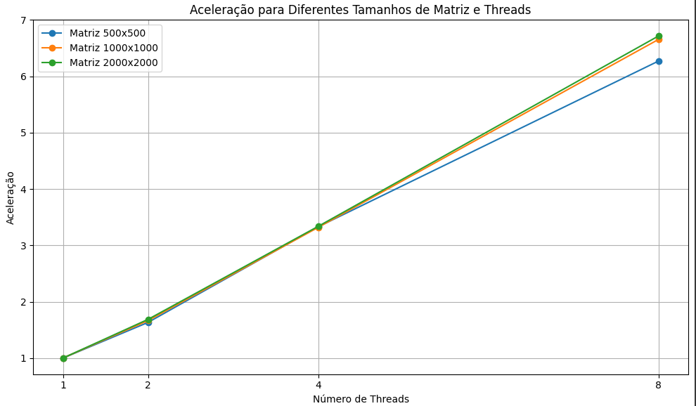
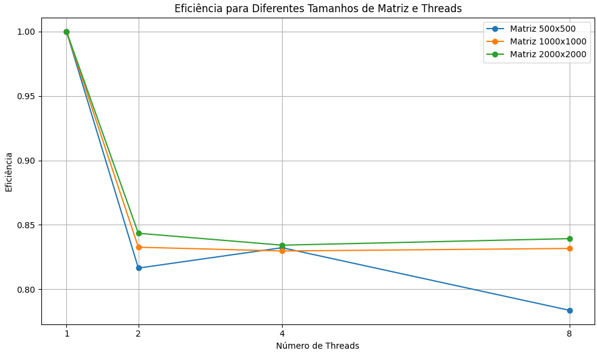

# Relatorio


# Modo de Execução e Descrição dos Arquivos
Existem dois programas, o sequencial e o concorrente.

Modo de execução do programa sequencial -> `./atividade_sequencial_tempo <Matriz1.bin> <Matriz2.bin> <resultado.bin>`<br><br>
Modo de execução do programa concorrente -> `./atividade_concorrente_tempo <Matriz1.bin> <Matriz2.bin> <Numero_de_threads> <saida.bin> <valida.bin>`<br><br>
Na pasta `Matrizes Usadas` temos as matrizes usadas para calcular o tempo de execução, a multiplicação foi feita sempre na ordem MatrizA . MatrizB para termos uma base de comparação, em que medimos o tempo de execução realizando sempre as mesmas operações.

## Parâmetros
**No modelo sequencial, temos os seguintes argumentos (respectivamente):** 
1) Matriz1.bin é a matriz A 
2) Matriz2.bin é a matriz B  
3) resultado.bin é o arquivo binário de saida que armazenará o resultado da matiplicação de A.B<br><br>


**No modelo concorrente, temos os seguintes argumentos (respectivamente):** 
1) Matriz1.bin é a matriz A
2) Matriz2.bin é a matriz B 
3) numero_de_threads é a quantidade de threads que será utilizada
4) resultado.bin é o arquivo binário de saida em que será escrito o resultado da matiplicação de A.B 
5) valida.bin é o arquivo binário que deve contar o resultado da multiplicação de A.B, ou seja, deve-se executar primeiro o código sequencial para obter esse arquivo. 


# Teste Automático
Para realizar o teste, devemos executar o programa sequencial e o ultimo argumento passado será o arquivo utilizado para validação do código concorrente.

Exemplo arbitrário
```
./atividade_sequencial_tempo ./Matrizes\ Usadas/matrizA_2x2.bin ./Matrizes\ Usadas/matrizA_2x2.bin valida.bin
```

Checa o resultado da multiplicação:
```
./atividade_concorrente_tempo ./Matrizes\ Usadas/matrizA_2x2.bin ./Matrizes\ Usadas/matrizA_2x2.bin 1 saida.bin valida.bin
```

# Etapas de Idealição/Descrição da Atividade
Nos códigos implementados, a multiplicação das matrizes é realizada na ordem em que as matrizes são passadas como argumentos. 
Portanto, se chamarmos o programa como `./atividade_sequencial_tempo matrizA.bin matrizB.bin`, a multiplicação A.B será realizada, onde A é a matriz lida do arquivo matrizA.bin e B é a matriz lida do arquivo matrizB.bin. Para realizar a multiplicação de B.A, a chamada do arquivo deve ser `./atividade_sequencial_tempo matrizB.bin matrizA.bin`.

## Sequencial
**Descrição da Implementação Sequencial:**
obs: alguns detalhes mais específicos de implementação foram explicados/citados através dos comentários no próprio código.

**Definição da Estrutura da Matriz:** É definida uma estrutura Matriz para representar uma matriz, contendo o número de linhas, o número de colunas e um ponteiro para os dados da matriz.

**Função criar_matriz:** Aloca dinamicamente memória para uma matriz com um número específico de linhas e colunas.

**Função liberar_matriz:** Libera a memória alocada dinamicamente para uma matriz.

**Função ler_matriz:** Lê uma matriz de um arquivo binário, onde os dois primeiros inteiros indicam o número de linhas e colunas, seguidos pelos elementos da matriz.

**Função multiplicar_matrizes:** Multiplica duas matrizes previamente alocadas e retorna a matriz resultante.

**Função main:**   
   Verifica se o número correto de argumentos foi passado na linha de comando.
   Inicia a medição do tempo total de execução e do tempo de inicialização.
   Lê as duas matrizes dos arquivos binários fornecidos como argumentos.
   Inicia a medição do tempo de processamento.
   Realiza a multiplicação das matrizes.
   Finaliza a medição do tempo de processamento.
   Escreve a matriz resultante em um arquivo binário.
   Libera a memória alocada para as matrizes.
   Finaliza a medição do tempo total de execução.
   Imprime os tempos de execução total, inicialização, processamento e finalização.

## Concorrente
**Descrição da Implementação Concorrente:**
obs: alguns detalhes mais específicos de implementação foram explicados/citados através dos comentários no próprio código.
**Estrutura da Matriz:** Define uma estrutura Matriz para armazenar o número de linhas, colunas e os dados da matriz.

**Funções de Manipulação de Matriz:**   
   criar_matriz: Aloca dinamicamente memória para uma matriz.
   liberar_matriz: Libera a memória alocada para uma matriz.
   ler_matriz: Lê uma matriz de um arquivo binário e retorna um ponteiro para ela.

**Multiplicação de Matrizes:**
   multiplicar_matrizes: Multiplica duas matrizes usando threads para distribuir o trabalho entre elas. Divide o trabalho em linhas, onde cada thread calcula um conjunto específico de linhas da matriz resultante.

**Funções para Threads:**
   thread_multiplicacao: Função executada por cada thread para calcular uma parte da matriz resultante.

**Estrutura de Argumentos para as Threads:**
   ThreadArgs: Estrutura que armazena os argumentos necessários para cada thread, incluindo as matrizes de entrada, a matriz de resultado e os índices de linha que a thread deve calcular.

**Função Principal (main):**
   Lê as duas matrizes de arquivos binários fornecidos como argumentos de linha de comando.
   Define o número de threads a serem usadas para a multiplicação das matrizes.
   Calcula o tempo de inicialização do programa, processamento e finalização.
   Multiplica as matrizes usando a função multiplicar_matrizes.
   Escreve a matriz resultante em um arquivo binário.
   Libera a memória alocada para as matrizes.
   Imprime o tempo total de execução, tempo de inicialização, tempo de processamento e tempo de finalização.

# Tempos de Execução
 ## Concorrente 8 threads

|        | Tempo de execução total (segundos) | Tempo de inicialização (segundos) | Tempo de processamento (segundos) | Tempo de finalização (segundos) |
|--------|------------------------------------|-----------------------------------|-----------------------------------|---------------------------------|
| A_500x500 . B_500x500 | 0.055214 | 0.001088 | 0.053100 | 0.001027 |
| A_1000x1000 . B_1000x1000 | 0.405361 | 0.003146 | 0.398497 | 0.003718 |
| A_2000x2000 . B_2000x2000 | 3.324505 | 0.008709 | 3.302497 | 0.013299 |


 ## Concorrente 4 threads

|        | Tempo de execução total (segundos) | Tempo de inicialização (segundos) | Tempo de processamento (segundos) | Tempo de finalização (segundos) |
|--------|------------------------------------|-----------------------------------|-----------------------------------|---------------------------------|
| A_500x500 . B_500x500 | 0.103726 | 0.001150 | 0.100004 | 0.002572 |
| A_1000x1000 . B_1000x1000 | 0.805069 | 0.003143 | 0.798890 | 0.003703 |
| A_2000x2000 . B_2000x2000 | 6.667555 | 0.008742 | 6.645131 | 0.013683 |


 ## Concorrente 2 threads
|        | Tempo de execução total (segundos) | Tempo de inicialização (segundos) | Tempo de processamento (segundos) | Tempo de finalização (segundos) |
|--------|------------------------------------|-----------------------------------|-----------------------------------|---------------------------------|
| A_500x500 . B_500x500 | 0.206003 | 0.001127 | 0.203886 | 0.002324 |
| A_1000x1000 . B_1000x1000 | 1.599065 | 0.003181 | 1.592167 | 0.003717 |
| A_2000x2000 . B_2000x2000 | 13.165231 | 0.008584 | 13.144807 | 0.013174 |


 ## Concorrente 1 thread
|        | Tempo de execução total (segundos) | Tempo de inicialização (segundos) | Tempo de processamento (segundos) | Tempo de finalização (segundos) |
|--------|------------------------------------|-----------------------------------|-----------------------------------|---------------------------------|
| A_500x500 . B_500x500 | 0.402654 | 0.001146 | 0.399577 | 0.001264 |
| A_1000x1000 . B_1000x1000 | 3.190822 | 0.003137 | 3.183579 | 0.003771 |
| A_2000x2000 . B_2000x2000 | 26.911711 | 0.008558 | 26.889448 | 0.013705 |


## Sequencial
|        | Tempo de execução total (segundos) | Tempo de inicialização (segundos) | Tempo de processamento (segundos) | Tempo de finalização (segundos) |
|--------|------------------------------------|-----------------------------------|-----------------------------------|---------------------------------|
| A_500x500 . B_500x500 | 0.337232 | 0.003446 | 0.332933 | 0.001186 |
| A_1000x1000 . B_1000x1000 | 2.663080 | 0.007834 | 2.651478 | 0.005435 |
| A_2000x2000 . B_2000x2000 | 22.201955 | 0.014359 | 22.174885 | 0.013379 |


## Configuração da Máquina
**CPU:** AMD Ryzen 7 3800X (16) @ 4.200GHz<br>
**GPU:** NVIDIA GeForce RTX 3060 Lite Hash Rate<br>
**Memory:** 23941MiB 

## Aceleração e Eficiência
Os dados obtidos durante as execuções foram utilizados no colab para plotar o gráfico de aceleração e eficiência.

**colab usado para plotar os gráficos:**<br>
https://colab.research.google.com/drive/1KW-AZaG68V3BK5TnKy6nIPrg_UEq_JMa?usp=sharing


Como visto em aula, definimos:
Aceleração = Tempo_sequencial/Tempo_paralelo




### Comentário Eficiencia
Eficiência = Aceleração/Número_de_Threads

Como podemos observar pelos tempo de execução, ao aumentar o número de threads o programa executa mais rapidamente, entretanto a eficiência para 8 threads é a pior, isso pode ocorrer por diversos fatores. Isso pode ser devido a várias razões:

    Overhead de Sincronização: Com o aumento no número de threads, pode haver um aumento significativo no tempo gasto em sincronização, comunicação e coordenação entre as threads. Esse overhead pode diminuir a eficiência global do programa.

    Balanceamento de Carga: É possível que o problema não seja suficientemente grande para justificar o uso de todas as 8 threads de forma eficiente. Se a carga de trabalho não for distribuída de maneira uniforme entre as threads, algumas podem ficar ociosas enquanto outras estão ocupadas, resultando em uma baixa eficiência global.

    Overhead de Criação de Threads: Criar e gerenciar threads adicionais também tem seu próprio custo. Com 8 threads, o tempo gasto na criação e destruição de threads pode superar os benefícios de paralelização, levando a uma eficiência reduzida.

vale destacar também que, apesar da eficiência de 8 threads ser a pior, ainda mantem um valor aceitável.


# Conclusão
Como era esperado o programa concorrente possui tempo médio de execução mais rápido. Esse "ganho de tempo" é notório para os casos em que possuimos mais tarefas, cenário em que poupamos tempo dividindo as tarefas entre as threads. 


Um comportamento que vale destacar é que o programa sequencial executa a tarefa mais rápido do que o programa concorrente de 1 thread, isso se dá pela quantidade de instruções em cada implementação, em que o programa concorrente executa uma série de blocos "inúteis" para o caso de possuir 1 única thread, enquanto o programa sequencial não e, consequentemente, o programa sequencial calcula a multiplicação de A.B de forma mais direta e rápida.
